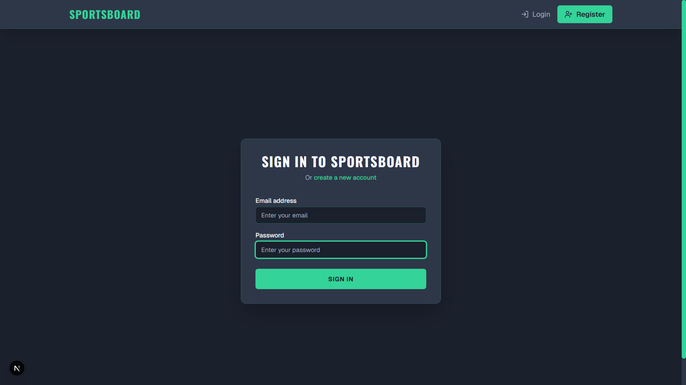
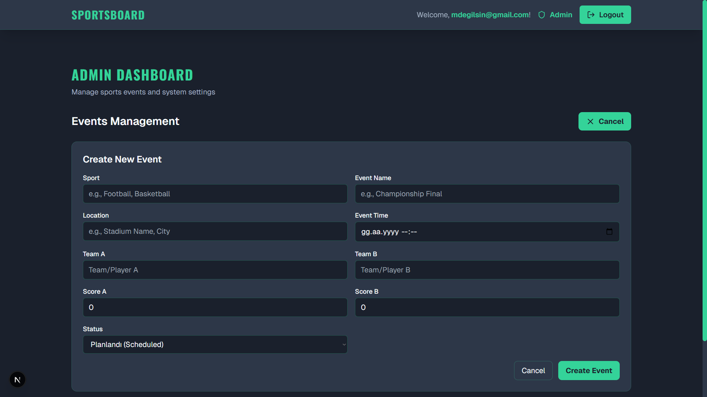
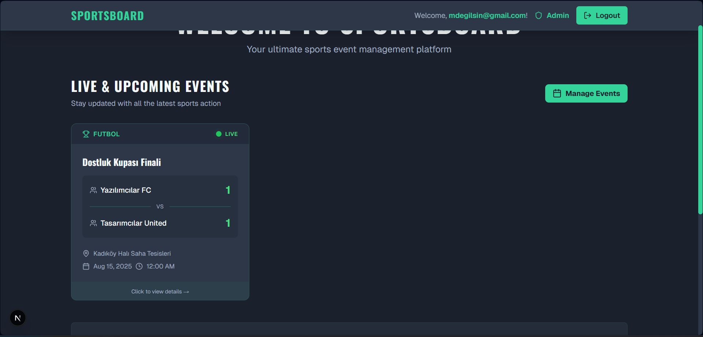

# 🏀 SportsBoard - Real-Time Sports Event Platform 🚀

**A modern, full-stack web platform for managing and tracking live sports events with real-time score updates, built with cutting-edge technologies for the ultimate sports management experience.**


## 🔗 Live Demo & Links

* **Live Application:** [➡️ **View Live Demo**](https://your-live-demo-link.com) *(Coming Soon)*
* **GitHub Repository:** [View on GitHub](https://github.com/OmerCalgan/sportsboard)

## 📸 Project Showcase

### Screenshots

| Login Page | Admin Dashboard | Live Event Board |
| :---: | :---: | :---: |
|  |  |  |
| *Secure authentication system* | *Full event management interface* | *Real-time score updates* |

### Demo GIF

*Watch how score updates propagate instantly across all connected clients!*

## ✨ Core Features

### 🔄 **Real-Time Score Updates**
- **Instant Broadcasting:** When an admin updates a score, all connected users see the change immediately without refreshing
- **WebSocket Technology:** Powered by Socket.IO for bidirectional, low-latency communication
- **Automatic Reconnection:** If connection drops, the system automatically reconnects and syncs latest data
- **Live Status Indicators:** Visual feedback showing when events are live, scheduled, or finished

### 🔐 **Role-Based Access Control (RBAC)**
- **Admin Role:**
  - Full CRUD operations on all sports events
  - Access to protected admin dashboard at `/admin/events`
  - Real-time score and status update capabilities
  - Event creation with comprehensive details (sport type, teams, location, time)
  - Bulk event management tools
  
- **User Role:**
  - View all public events and their details
  - Receive live score updates in real-time
  - Access to event history and statistics
  - Read-only permissions ensure data integrity

### 🛡️ **Secure JWT Authentication**
- **Modern Security:** JWT-based authentication with secure token management
- **Password Protection:** All passwords hashed using bcrypt with salt rounds
- **Session Management:** Secure cookie-based session handling
- **Protected Routes:** API endpoints protected based on user roles
- **Token Refresh:** Automatic token refresh mechanism for seamless user experience

### 📊 **Dynamic Event Management**
- **Comprehensive Event Details:**
  - Sport type classification
  - Team names and logos
  - Venue/location information
  - Scheduled date and time
  - Real-time score tracking
  
- **Event Status Management:**
  - **Planned:** Future events with countdown timers
  - **Live:** Currently active events with real-time updates
  - **Finished:** Completed events with final scores and statistics

### 🎨 **Modern & Responsive UI**
- **Dark Theme Design:** Eye-friendly dark mode with carefully selected color palette
- **Fully Responsive:** Optimized for all devices - desktop, tablet, and mobile
- **Smooth Animations:** Subtle transitions and loading states for better UX
- **Accessibility:** WCAG compliant with proper ARIA labels and keyboard navigation
- **Component-Based:** Reusable React components for consistency

## 🛠️ Tech Stack & Architecture

### Backend
| Technology | Purpose | Version |
|------------|---------|---------|  
| **NestJS** | Server framework with modular architecture | 10.x |
| **TypeScript** | Type safety and modern JavaScript features | 5.x |
| **Socket.IO** | Real-time bidirectional communication | 4.x |
| **MongoDB** | NoSQL database for flexible data storage | 7.x |
| **Mongoose** | Object Data Modeling (ODM) for MongoDB | 8.x |
| **Passport.js** | Authentication middleware | 0.7.x |
| **JWT** | Secure token-based authentication | 9.x |
| **bcrypt** | Password hashing and security | 5.x |
| **class-validator** | Request validation and sanitization | 0.14.x |

### Frontend
| Technology | Purpose | Version |
|------------|---------|---------|  
| **Next.js** | React framework with App Router | 15.x |
| **TypeScript** | Type safety for React components | 5.x |
| **React** | UI component library | 19.x |
| **Tailwind CSS** | Utility-first CSS framework | 3.x |
| **Axios** | HTTP client for API requests | 1.x |
| **Socket.IO Client** | Real-time client-side communication | 4.x |
| **js-cookie** | Cookie management | 3.x |
| **Lucide React** | Modern icon library | Latest |

### DevOps & Infrastructure
| Technology | Purpose |
|------------|---------|  
| **Docker** | Application containerization |
| **Docker Compose** | Multi-container orchestration |
| **Environment Variables** | Configuration management |
| **Anonymous Volumes** | Preserve node_modules in containers |

### Architecture Overview
```
┌─────────────────────────────────────────────────────────────┐
│                         Frontend (Next.js)                  │
│                        http://localhost:3000                │
├─────────────────────────────────────────────────────────────┤
│                             ↕ HTTP/WS                       │
├─────────────────────────────────────────────────────────────┤
│                         Backend (NestJS)                    │
│                        http://localhost:5001                │
├─────────────────────────────────────────────────────────────┤
│                              ↕ TCP                          │
├─────────────────────────────────────────────────────────────┤
│                         MongoDB Database                    │
│                        mongodb://localhost:27017            │
└─────────────────────────────────────────────────────────────┘
```

## 🚀 Getting Started

### Prerequisites
Before you begin, ensure you have the following installed:
- **Docker Desktop** (v20.10 or higher)
- **Docker Compose** (v2.0 or higher)
- **Git** (latest version)
- **Node.js** (v20.x) - *Optional for local development*

### Installation Steps

1. **Clone the Repository**
   ```bash
   git clone https://github.com/OmerCalgan/sportsboard.git
   cd sportsboard
   ```

2. **Set Up Environment Variables**
   
   Create environment files for both backend and frontend:
   
   **Backend Configuration** (`backend/.env`):
   ```env
   # Database
   DATABASE_URL=mongodb://mongodb:27017/sportsboard
   
   # JWT Configuration  
   JWT_SECRET=your-super-secret-jwt-key-change-this-in-production
   JWT_EXPIRES_IN=7d
   
   # Server Configuration
   PORT=5001
   NODE_ENV=development
   ```
   
   **Frontend Configuration** (`frontend/.env.local`):
   ```env
   # API Configuration
   NEXT_PUBLIC_API_URL=http://localhost:5001
   ```

3. **Build and Run with Docker Compose**
   ```bash
   # Build and start all services
   docker-compose up --build
   
   # Or run in detached mode
   docker-compose up -d --build
   ```

4. **Verify Installation**
   
   Wait for all services to start (usually takes 1-2 minutes), then verify:
   - Frontend: Open [http://localhost:3000](http://localhost:3000)
   - Backend API: Open [http://localhost:5001](http://localhost:5001)
   - MongoDB: Running on `mongodb://localhost:27017`

5. **Create Your First Admin Account**
   
   - Navigate to [http://localhost:3000/register](http://localhost:3000/register)
   - Register with your email and password
   - To make yourself an admin, update your user role in MongoDB:
     ```bash
     # Access MongoDB container
     docker exec -it sportsboard-mongodb-1 mongosh
     
     # Update user role
     use sportsboard
     db.users.updateOne(
       { email: "your-email@example.com" },
       { $set: { role: "admin" } }
     )
     ```

### 🧪 Testing the Real-Time Features

1. **Open Two Browser Windows**
   - Window 1: Login as admin and navigate to `/admin/events`
   - Window 2: Open the homepage as a regular user or guest

2. **Create a Live Event**
   - In the admin window, create a new sports event
   - Set status to "Live"

3. **Update Scores**
   - In the admin window, update the scores
   - Watch the scores update instantly in the user window!

## 📁 Project Structure

```
sportsboard/
├── backend/                  # NestJS backend application
│   ├── src/
│   │   ├── auth/            # Authentication module
│   │   ├── events/          # Events module with Socket.IO
│   │   ├── users/           # Users module
│   │   └── main.ts          # Application entry point
│   ├── Dockerfile
│   └── package.json
│
├── frontend/                 # Next.js frontend application
│   ├── src/
│   │   ├── app/             # Next.js App Router pages
│   │   ├── components/      # Reusable React components
│   │   ├── context/         # React Context providers
│   │   └── styles/          # Global styles
│   ├── Dockerfile
│   └── package.json
│
├── docker-compose.yml        # Multi-container orchestration
└── README.md                # Project documentation
```

## 🔧 Development

### Running Without Docker

If you prefer to run the services locally without Docker:

**Backend:**
```bash
cd backend
npm install
npm run start:dev
```

**Frontend:**
```bash
cd frontend
npm install
npm run dev
```

**MongoDB:**
Install MongoDB locally or use MongoDB Atlas cloud service.

### Common Docker Commands

```bash
# View logs
docker-compose logs -f [service-name]

# Restart a specific service
docker-compose restart frontend

# Stop all services
docker-compose down

# Stop and remove volumes (clean slate)
docker-compose down -v

# Rebuild a specific service
docker-compose build --no-cache [service-name]
```

## 🐛 Troubleshooting

### Common Issues and Solutions

| Issue | Solution |
|-------|----------|
| **Port already in use** | Stop other services or change ports in `docker-compose.yml` |
| **MongoDB connection failed** | Ensure MongoDB container is running: `docker ps` |
| **Frontend can't reach backend** | Check `NEXT_PUBLIC_API_URL` in frontend `.env.local` |
| **Real-time updates not working** | Verify WebSocket connection in browser DevTools |
| **Docker build fails** | Clear Docker cache: `docker system prune -a` |

### Debugging Tips

1. **Check Container Logs:**
   ```bash
   docker-compose logs frontend
   docker-compose logs backend
   docker-compose logs mongodb
   ```

2. **Verify Network Connectivity:**
   ```bash
   docker network inspect sportsboard_default
   ```

3. **Access Container Shell:**
   ```bash
   docker exec -it sportsboard-backend-1 /bin/sh
   ```

## 📈 Future Enhancements

- [ ] User profiles with avatars
- [ ] Team statistics and leaderboards
- [ ] Tournament bracket system
- [ ] Email notifications for event updates
- [ ] Mobile app with React Native
- [ ] Advanced analytics dashboard
- [ ] Export event data to CSV/PDF
- [ ] Multi-language support
- [ ] OAuth integration (Google, Facebook)
- [ ] Live chat during events

## 🤝 Contributing

Contributions are welcome! Please feel free to submit a Pull Request.

1. Fork the repository
2. Create your feature branch (`git checkout -b feature/AmazingFeature`)
3. Commit your changes (`git commit -m 'Add some AmazingFeature'`)
4. Push to the branch (`git push origin feature/AmazingFeature`)
5. Open a Pull Request

## 📄 License

This project is licensed under the MIT License - see the [LICENSE](LICENSE) file for details.

## 👨‍💻 Author

**Ömer Çalgan**
- GitHub: [@OmerCalgan](https://github.com/OmerCalgan)
- LinkedIn: [Your LinkedIn Profile](https://linkedin.com/in/your-profile)
- Email: your.email@example.com

## 🙏 Acknowledgments

- [NestJS](https://nestjs.com/) for the powerful backend framework
- [Next.js](https://nextjs.org/) for the amazing React framework
- [Socket.IO](https://socket.io/) for real-time communication capabilities
- [MongoDB](https://www.mongodb.com/) for flexible data storage
- [Docker](https://www.docker.com/) for containerization
- All contributors and open-source maintainers

---

<p align="center">Made with ❤️ by Ömer Çalgan</p>
<p align="center">⭐ Star this repository if you find it helpful!</p>
